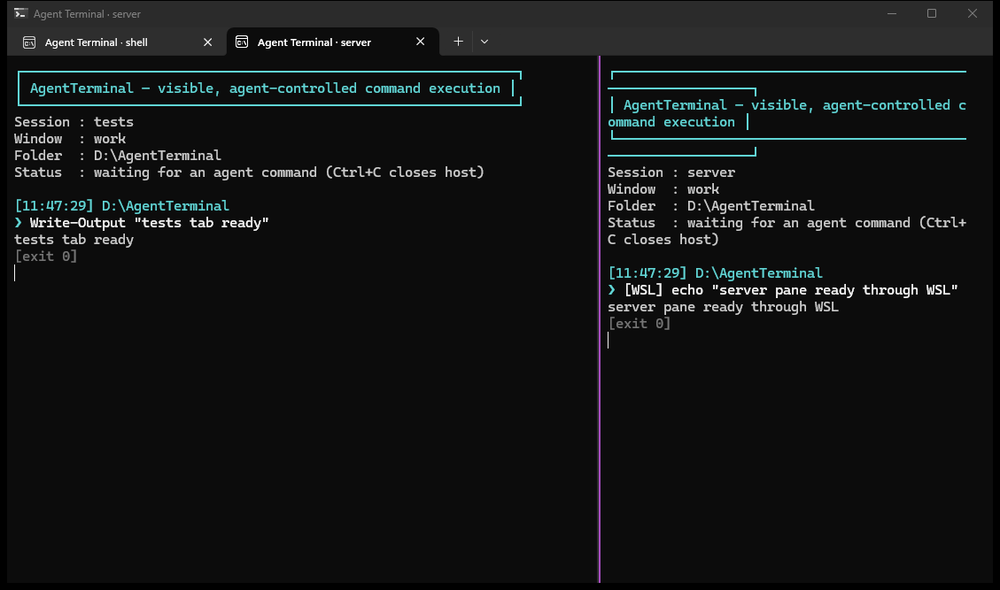

# AgentTerminal

AgentTerminal is a small .NET 8 bridge between a coding agent and a **visible Windows Terminal window**. The agent calls a normal CLI; you see the exact command and its live stdout/stderr in the popup. The same output returns to the agent so it can continue working.

It uses Windows Terminal instead of attempting to reimplement terminal rendering, tabs, fonts, selection, or window management. Control travels over a local named pipe restricted to the current Windows user.



## Build and start

```powershell
dotnet publish .\AgentTerminal\AgentTerminal.csproj -c Release -r win-x64 --self-contained false -p:PublishSingleFile=true -o .\dist
$at = Resolve-Path .\dist\AgentTerminal.exe
& $at new-window --window work --name shell --cwd C:\path\to\your\repo
```

## Windows, tabs, and panes

`--window` names a Windows Terminal window group. `--name` names the independently
addressable AgentTerminal session inside that window. Every tab or pane must have a
unique session name.

```powershell
# Open a named Windows Terminal window containing session "shell".
& $at new-window --window work --name shell --cwd C:\path\to\your\repo

# Add a tab to that window.
& $at new-tab --window work --name tests --cwd C:\path\to\your\repo

# Split the currently active tab in that window. Size is the new pane's share.
& $at split-pane --window work --name server --vertical --size 0.40 --cwd C:\path\to\your\repo

# Route commands to any session by name.
& $at run --name tests -- dotnet test
& $at run --name server --shell "dotnet run"
```

Aliases are available: `start`/`window`, `tab`, and `split`. `start` remains compatible
with the original one-window workflow. If a targeted Windows Terminal window no longer
exists, Windows Terminal may create it when a tab or pane command is sent.

Then an agent (or you) can run:

```powershell
& $at run --name shell -- git status --short
& $at run --name tests --cwd C:\path\to\your\repo -- dotnet test
& $at run --name shell --shell "npm run build; git status --short"
& $at run --name hermes --wsl "uname -a && git status --short"
```

The first two forms execute a program directly, without shell interpolation. `--shell` deliberately invokes PowerShell for pipes, redirection, variables, or multiple statements.

## WSL / Hermes

WSL can invoke Windows executables directly. Use the mounted Windows path. Direct
commands run on the Windows host; use `--wsl` when the payload itself must run in Linux:

```bash
/mnt/d/AgentTerminal/dist/AgentTerminal.exe run --name hermes --wsl 'git status --short'
```

Start the visible host on Windows first (recommended), or start it from WSL through `cmd.exe`:

```bash
cmd.exe /c 'C:\path\to\AgentTerminal.exe start --name hermes --cwd C:\path\to\repo'
```

## Agent instruction

Give Claude Code, Codex, or another tool-using agent this constraint:

> For commands I should be able to watch, call `AgentTerminal.exe run --name <session> -- <program> <args>` instead of executing them directly. Create additional destinations with `new-tab` or `split-pane`, giving each a unique session name. Use `--shell "..."` only when shell syntax is required.

## Scope

This first version is a visible, auditable command runner—not remote keyboard injection. Commands are serialized, output is mirrored live, and exit codes are preserved. Fully interactive programs that require stdin (editors, password prompts, REPLs) are intentionally not supported yet.
